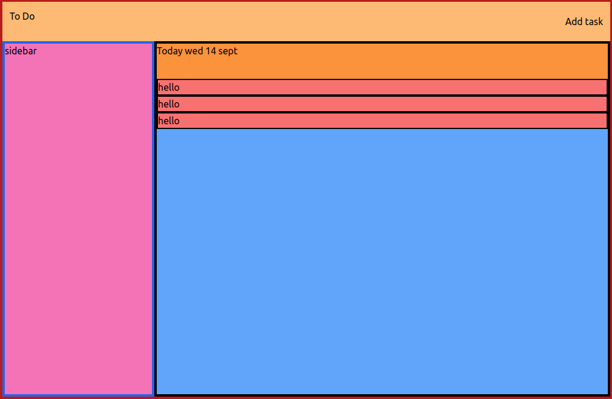
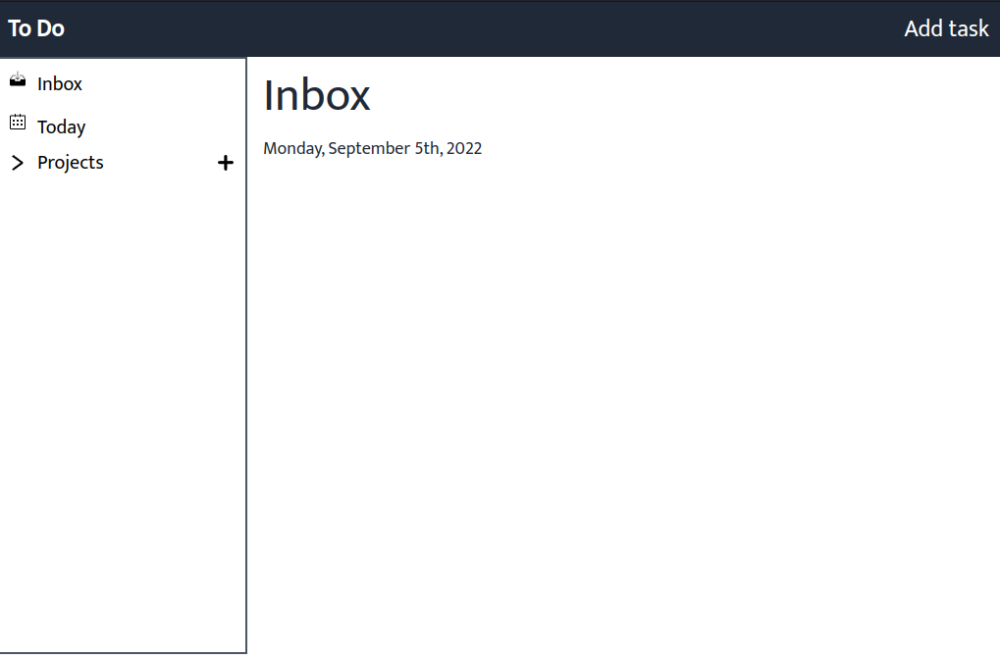

# To-Do App

## Initial look

## Final look

# What is To-Do app Project

This is a project assignment on the odin project. It's a clone of the famous todoist app. User can do all create, update and delete task.

# What did I learn?

- Learned tailwind css
- How to configure tailwind css with webpack
- How to break code into small and different functions
- How to break an app into different modules.
- Learned a lot about debugging.
- When and where to add breakpoints.
- Use of watch option in devtools.

# Live Link

https://muditchoudhary.github.io/todo-app/

# Icons, Images, Svg Images, Color Pellate Credits

- Icons by <a href="https://www.svgrepo.com/">Svg Repo</a>
